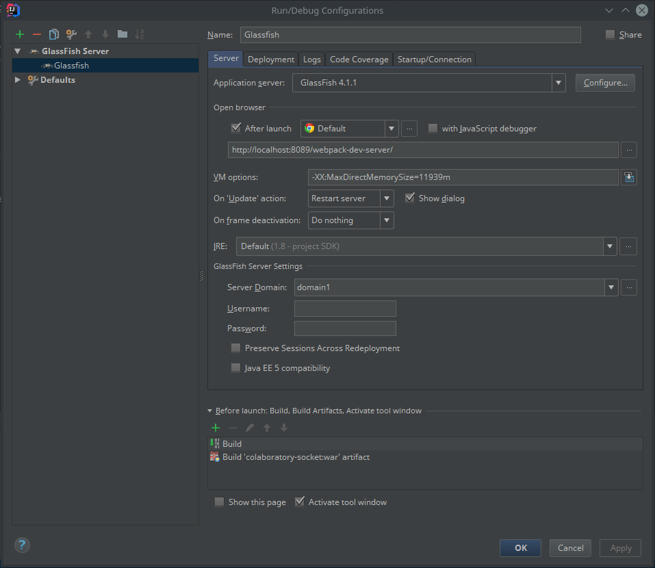
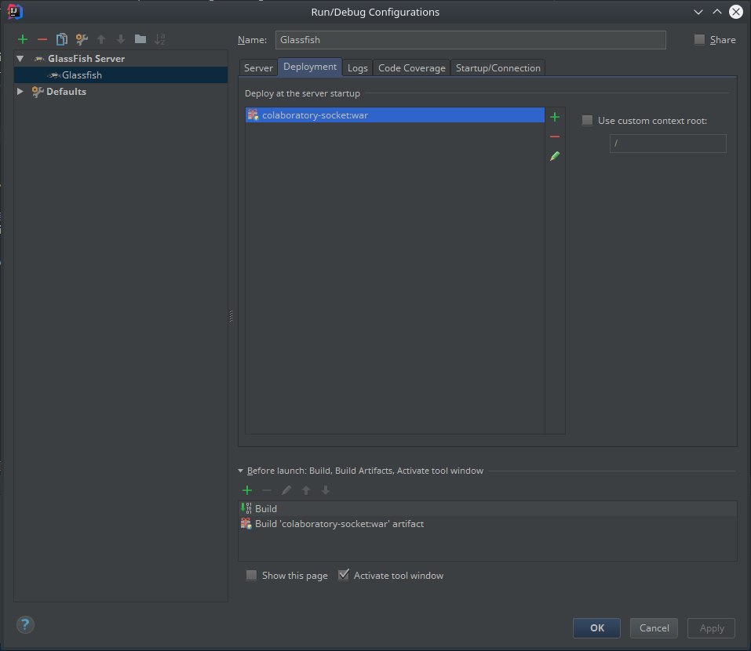
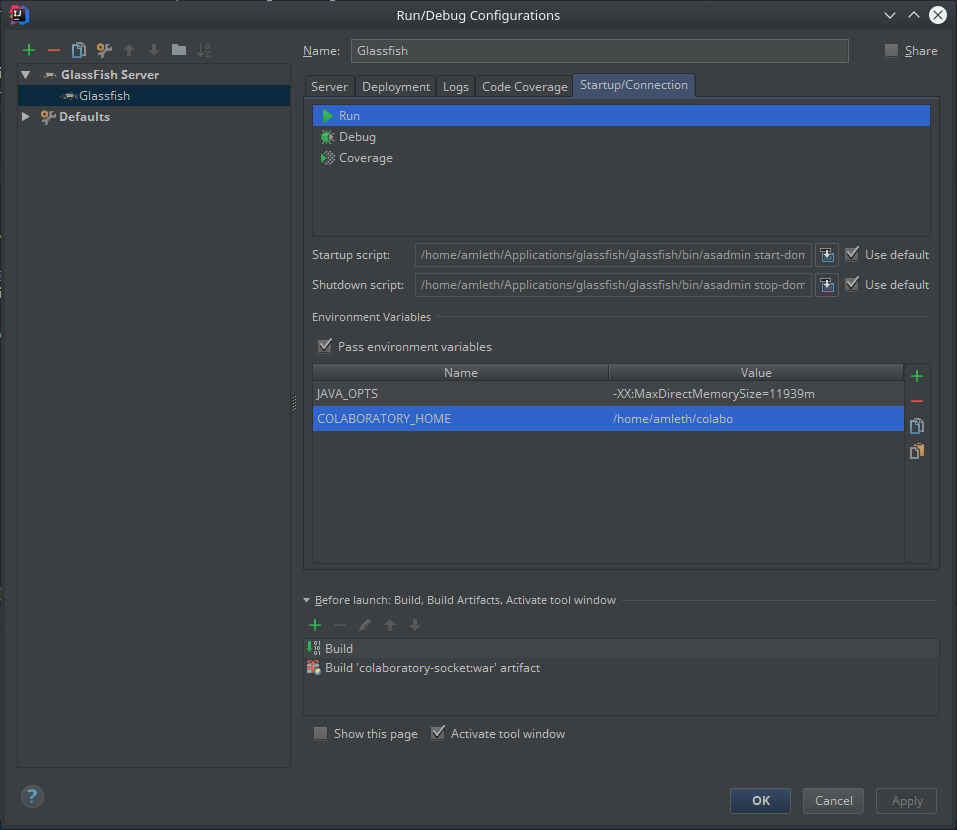

# Les services du Collaboratoire ERECOLNAT 

Technologies convoquées :

  - langage Java (7)
  - conteneur Web [Tomcat](http://tomcat.apache.org/)
  - gestion de projet [Maven](https://maven.apache.org/)
  - base de données [OrientDB](http://orientdb.com/)

---

## Déploiement

### Compilation du war

	cd commons
	mvn clean package install
	cd ..
	cd ./services/websocket
	mvn clean package
	cd ..

Le `war` final se trouve là : `services/websocket/target/colaboratory-socket-X.Y.Z.war`

### Exécution

Les données de l'application sont stockées dans un dossier pointé par la variable d'environnement COLABORATORY_HOME :

  - `backups` : dossier contenant les sauvegardes de la base de données générées automatiquement par l'application
  - `colaboratory-socket.yml` : fichier de configuration de l'application (paramètres relatifs à la base de données, aux performances, à l'authentification, au *logging*...)
  - `db` : dossier contenant la base de données
  - `logback.xml` : fichier de configuration du *logger*
  - `logs` : dossier contenant les *logs*

### Petit script de compilation & déploiement vers le serveur de test

  > #!/bin/sh
  > cd ~/Dropbox/CNAM/recolnat/recolnat-lab
  > 
  > cd ./commons
  > mvn clean package install
  > cd ..
  > cd ./services/websocket
  > mvn clean package
  > cd ..
  > 
  > SFTP_COMMANDS="put websocket/target/colaboratory-socket-0.9.3.war /apps/tomcat8-dev/webapps/colaboratory-socket-test-0.9.3.war"
  > sftp cnamuser@wp5test.recolnat.org << EOF
  >   $SFTP_COMMANDS
  > EOF

---

## Développement local

Lors de la reprise du code en juin 2017, l'application était dépendante du contexte de déploiement sur les serveurs du MNHN (base de données, domaines, intégration de services tiers, authentification CAS, etc.). Nous nous sommes donc efforcés de rendre un développement local possible.

### Dossier du Collaboratoire

Créer un dossier vide qui sera le `$COLABORATORY_HOME` local.

### Base de données

La solution la plus simple pour utiliser des données réelles, générées en production, est de rapatrier un export automatique de la base de données situé dans le dossier `$COLABORATORY_HOME/backups` du serveur de production (`/apps/colaboratory/backups/`). Ce dossier contient trois types de fichiers :

  - `<NOM>-<DATE>`
  - `<NOM>-EXPORTS-<DATE>`
  - `<NOM>-UAC-<DATE>`

Après avoir repéré le triplet de fichiers portant la même date :

  1. Dézipper `<NOM>-<DATE>` en un dossier nommé `<NOM>` (note : sur le serveur de production, `<NOM>` est `ReColNatPlus`). Bien que sans extension, ce fichier est en fait un zip. Copier ce dossier dans `$COLABORATORY_HOME\db`.
  2. Renommer `<NOM>-EXPORTS-<DATE>` en `uexports.db`. Le copier dans `$COLABORATORY_HOME\db`.
  3. Renommer `<NOM>-UAC-<DATE>` en `uac.db`. Le copier dans `$COLABORATORY_HOME\db`.

### Exécution du service

Télécharger [GlassFish](http://download.oracle.com/glassfish/). La version 4.1.2 a été utilisée pour rédiger ce document.

OrientDB semble exiger le paramètre de JVM suivant : `-XX:MaxDirectMemorySize=11939m`.

### Configuration d'un serveur GlassFish dans IntelliJ IDEA

